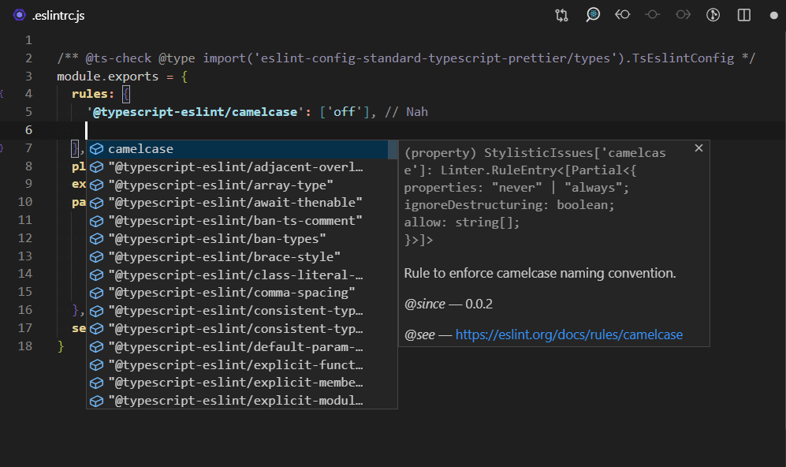

# Eslint config: StandardJS, Typescript, Prettier

A simple **eslint** config for modern **TypeScript** projects.

This package configures **eslint** with:
- **Typescript** support https://github.com/typescript-eslint/typescript-eslint
- **StandardJs** rules https://github.com/standard/eslint-config-standard
- **Prettier** rules https://github.com/prettier/eslint-plugin-prettier
- **`@typescript-eslint/recommended`** rules https://github.com/typescript-eslint/typescript-eslint/tree/master/packages/eslint-plugin
- Requires semicolons (from prettier) for consistancy with types
- Disables some opinionated type check rules

> For reference: [./eslint.js](./eslint.js).

----------

+ [1. Install](#1-install)
+ [1.1 Install Peer Dependencies](#11-install-peer-dependencies)
+ [2. Configure](#2-configure)
+ [3. Bonus configure](#3-bonus-configure)
+ [FAQ](#faq)
  + [I want fine grained control](#i-want-fine-grained-control)
  + [Eslint cant find my files](#eslint-cant-find-my-files)
  + [I want linting to appear as warnings, not errors](#i-want-linting-to-appear-as-warnings-not-errors)
+ [Project future](#project-future)
+ [Potential issues](#potential-issues)

-----------------

## 1. Install

> Note: For an even "easier" install option, see https://github.com/nfour/eslint-config-nfour

```sh
yarn add -D eslint-config-standard-typescript-prettier
```

## 1.1 Install Peer Dependencies

Install all the peer dependencies listed in [this projects package.json](./package.json) into your project.

This should do the trick:

```sh
npx install-peerdeps -o --dev --yarn eslint-config-standard-typescript-prettier
```

## 2. Configure

Add this to your `package.json`:

```json
"eslintConfig": {
  "extends": ["standard-typescript-prettier"],
  "parserOptions": { "project": "./tsconfig.json" }
},
"prettier": "eslint-config-standard-typescript-prettier/prettier"
```

> For other config recipes, see [I want fine grained control](#I-want-fine-grained-control)

## 3. Bonus configure

Add the comment below to get type checks on your rules in a `.eslintrc.js`

> /** @ts-check @type import('eslint-config-standard-typescript-prettier/types').TsEslintConfig */



## FAQ

### I want fine grained control

The packages exports a plain object, go nuts!

In an `.eslintrc.js`:

```js
const config = require('eslint-config-standard-typescript-prettier');

module.exports = {
  ...config,
  parserOptions: { project: "./tsconfig.json" },
  rules: {
    ...config.rules,
    "@typescript-eslint/no-explicit-any": "error",
  },
};
```

> Eslint might be changing their config, which is why a `.eslintrc.js` format is recommended.
> 
> More info: https://github.com/eslint/rfcs/pull/9

In a `.prettierrc.js`:

```js
module.exports = {
  ...require('eslint-config-standard-typescript-prettier/prettier'),
  semi: false, // This is how you turn off semicolons, by the way
}
```

### Eslint cant find my files

On the CLI, `eslint` requires the `--ext` flag (currently):
```
eslint --ext .ts,.tsx .
```


### I want linting to appear as warnings, not errors

By default, lint errors can become mixed with TypeScript errors during development.

`eslint-plugin-only-warn` is already included in this package, so do this:

```json
{
  "plugins": ["only-warn"],
  "extends": ["standard-typescript-prettier"],
  "parserOptions": { "project": "./tsconfig.json" }
}
```

Want your lint warnings turned into errors?

> `yarn eslint --max-warnings 1`

## Project future

Javascript churn is real. This project will be kept up to date **only** for as long as configuration remains tedious.

## Potential issues

The peerDependencies listed are versioned for compatibility. Because you maintain these dependencies in your project, you'll have to keep them all in sync or you could have issues.
